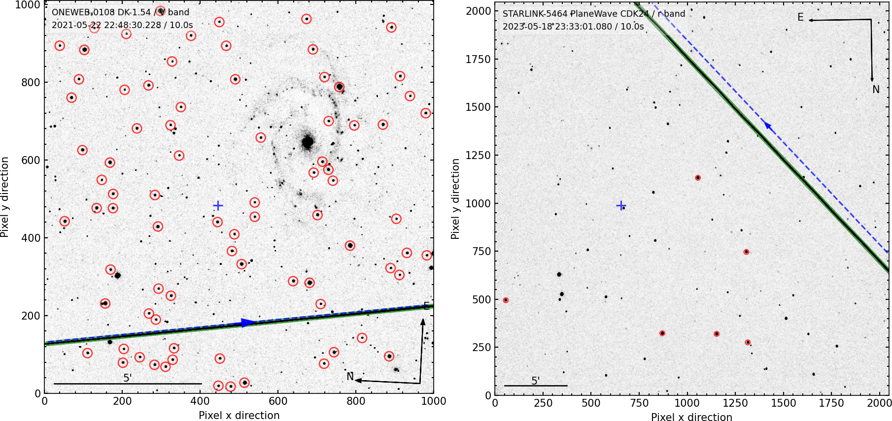
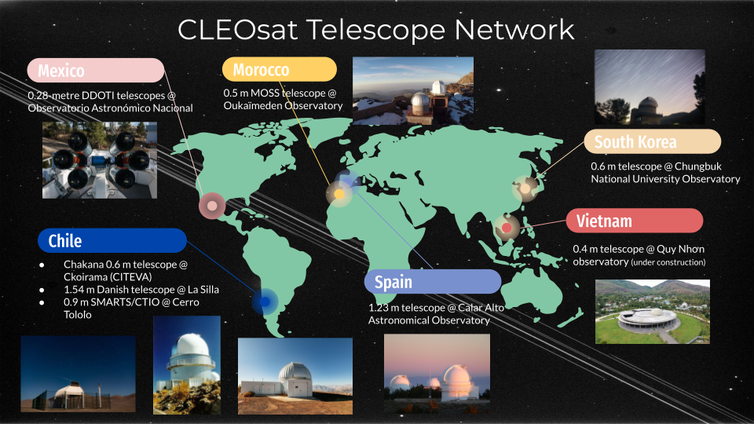

.. LEOSatpy documentation master file, created by
   sphinx-quickstart on Wed May 31 15:00:11 2023.
   You can adapt this file completely to your liking, but it should at least
   contain the root `toctree` directive.

.. _ckoir: https://www.astro.uantof.cl/research/observatorios/ckoirama-observatory/

.. |ckoir| replace:: Ckoirama Observatory

.. _ctio: http://www.astro.yale.edu/smarts/0.9m.html

.. |ctio| replace:: Small and Moderate Aperture Research Telescope System

.. _dk154: https://www.eso.org/public/teles-instr/lasilla/danish154/

.. |dk154| replace:: 1.54-metre Danish telescope

.. _spm: https://www.astrossp.unam.mx/es/

.. |spm| replace:: Observatorio Astronómico Nacional

.. _ouka: https://moss-observatory.org/

.. |ouka| replace:: MOSS telescope

.. _cbnuo: https://www.chungbuk.ac.kr/site/english/main.do

.. |cbnuo| replace:: Chungbuk National University Observatory

.. _ca123: https://www.caha.es/CAHA/Telescopes/1.2m.html

.. |ca123| replace:: 1.23-metre telescope

Welcome to LEOSatpy's documentation!
====================================

**LEOSatpy** (Low Earth Orbit satellite python) is an end-to-end pipeline to process and analyse
satellite trail observations from different telescopes.

.. note::

   When publishing data processed and analysed with LEOSatpy, please :ref:`cite LEOSatpy <Citing LEOSatpy>`.

   *Two example of satellite observations reduced and analysed with LEOSatpy: Comparison stars are indicated with red circles.*

Contents
--------

.. toctree::
   :maxdepth: 1

   Home <self>
   installation
   configfile
   usage
   contributing
   citing
   todo
   acknowledgements
   GitHub <https://github.com/CLEOsat-group/leosatpy>

----

Package Content
---------------

The important files for the process in this directory:

===========================  ==========================================================================
Program                      Function
===========================  ==========================================================================
``reduceSatObs.py``          Perform reduction of satellite observations.
``calibrateSatObs.py``       Perform astrometric calibration using GAIA DR3 positions.
``analyseSatObs.py``         Detect satellite trail(s) and perform aperture photometry using
                             comparison stars from the GSC 2.4.3 catalog.
===========================  ==========================================================================

Supported Telescopes
--------------------

   *Telescopes participating in the CLEOSat observation network.*

Observations from the following telescopes are currently supported:

* 0.6-metre Chakana telescope at the |ckoir|_ of the Universidad de Antofagasta, Antofagasta, Chile.
* 0.9-metre |ctio|_ (SMARTS)
  at Cerro Tololo Inter-american Observatory (CTIO), Chile.
* |dk154|_ at the La Silla Observatory, Chile.
* 0.28-metre DDOTI (Deca-Degree Optical Transient Imager) telescopes at the |spm|_ (OAN) in Sierra San Pedro Martír (SPM), Baja California, México.
* 0.5-metre |ouka|_ at the Oukaïmeden Observatory, Morocco.
* 0.6-metre telescope of the |cbnuo|_ in Jincheon, South Korea.
* |ca123|_ at the Calar Alto Observatory, Spain.

.. note::

    If you want your telescope added to the list, please contact
    `Jeremy Tregloan-Reed <jeremy.tregloan-reed@uda.cl>`_.

Catalog WebServices
-------------------

The positions of reference stars for astrometric calibration where obtained from the GAIA DR3 catalog via
`astroquery <https://astroquery.readthedocs.io/en/latest/#>`_

The positions and magnitudes of the comparison stars are collected using the
`WebServices for Catalog Access <https://outerspace.stsci.edu/display/GC/WebServices+for+Catalog+Access>`_
to the Guide Star Catalog(s) v2.4.3.

----------------

Copyright notice:
-----------------

The LEOSat Python package is free software: you can redistribute it and/or modify it under
the terms of the GNU General Public License as published by the Free Software Foundation,
version 3 of the License.

The LEOSat Python package is distributed in the hope that it will be useful, but without
any warranty; without even the implied warranty of merchantability or fitness for a
particular purpose. See the GNU General Public
`LICENSE <https://github.com/CLEOsat-group/leosatpy/blob/master/LICENSE>`_ file for the precise terms and conditions..

You should have received a copy of the GNU General Public License along with the LEOSat
Python package. If not, see http://www.gnu.org/licenses/.
